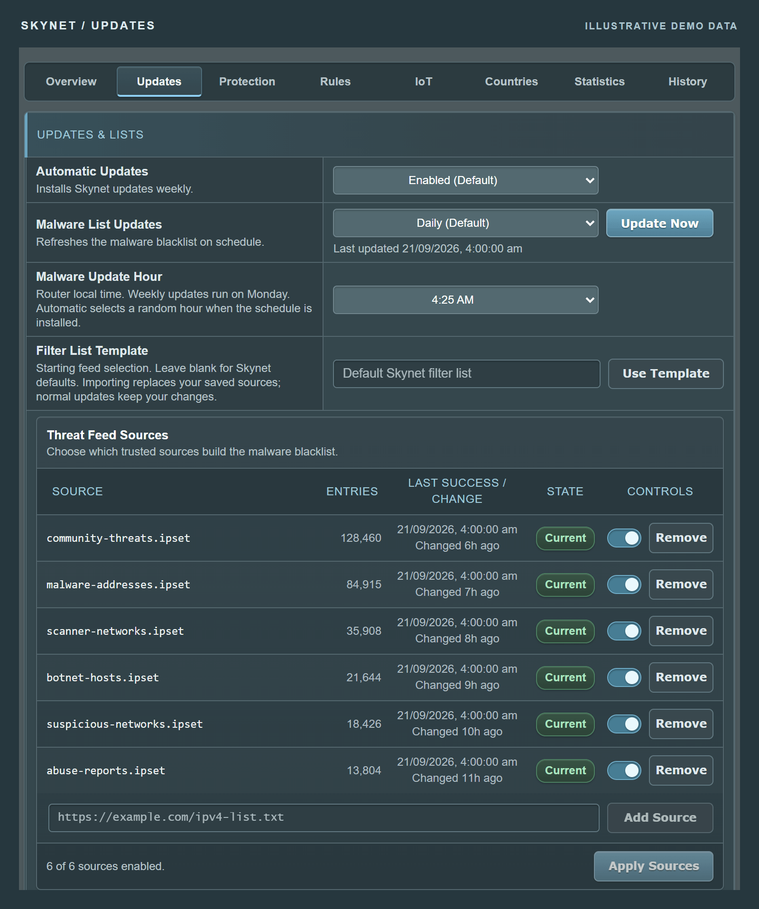
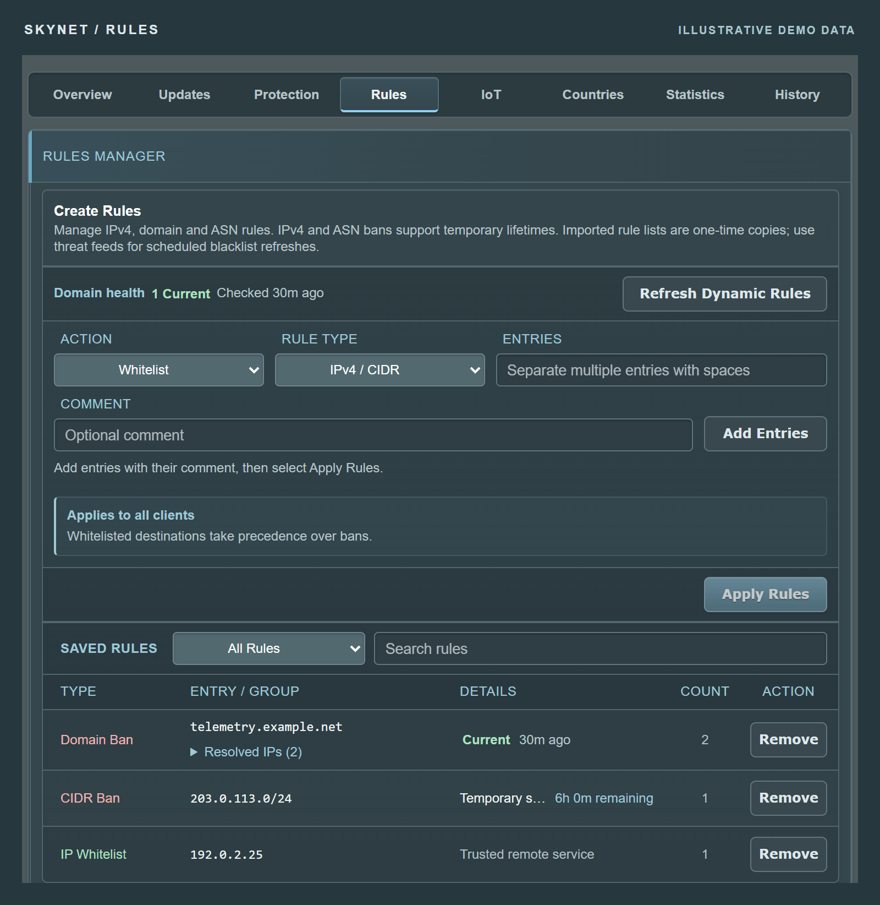
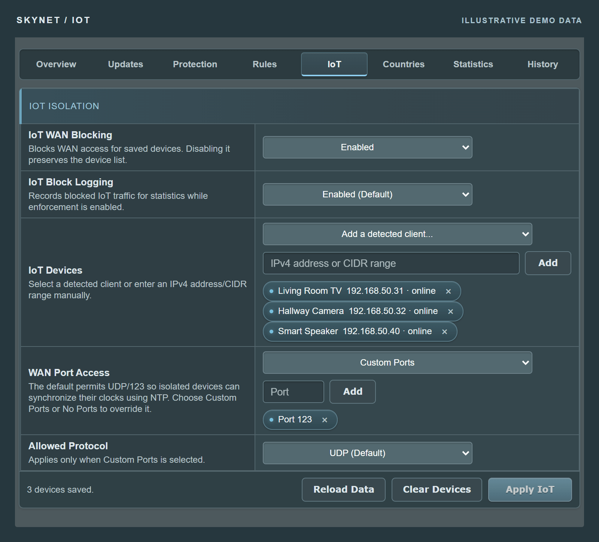
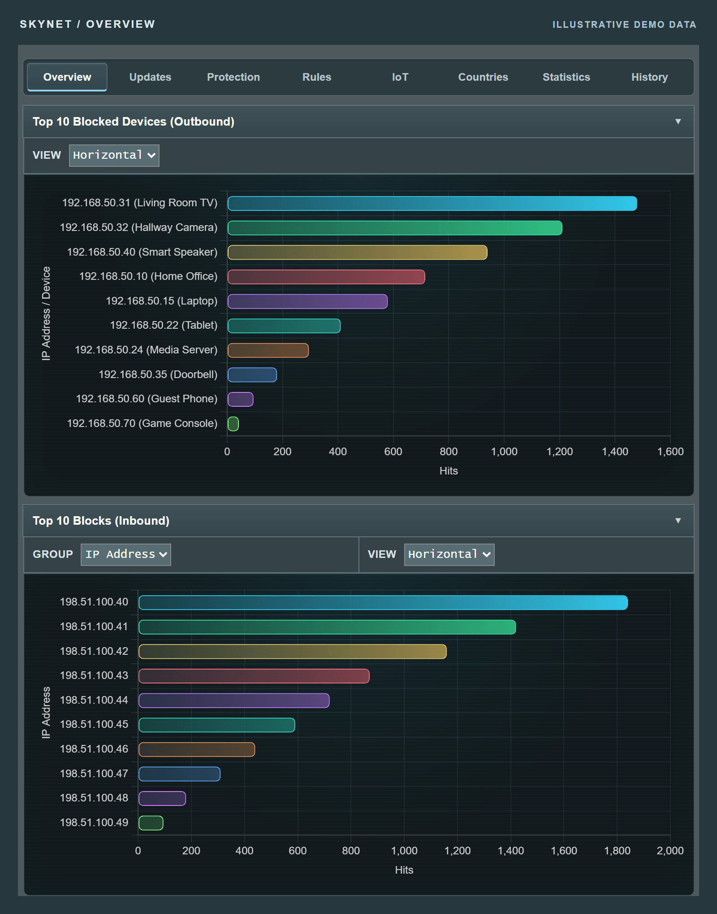
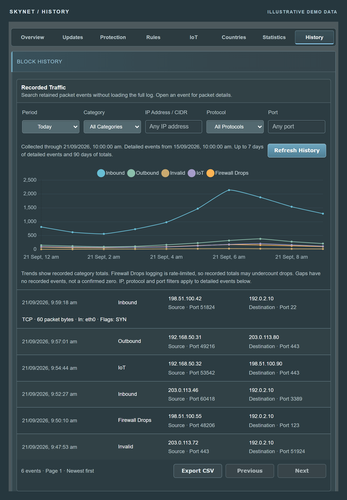
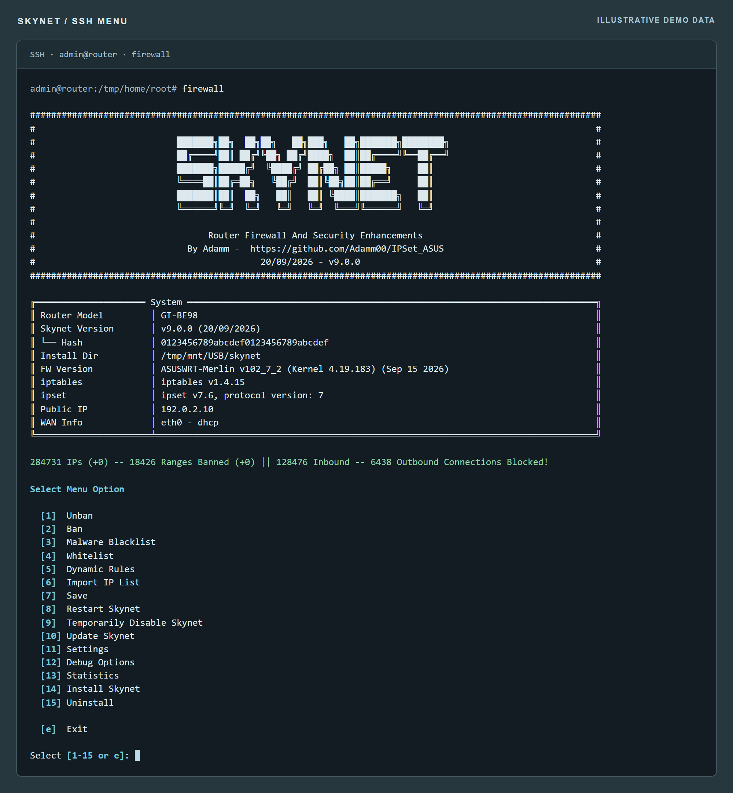

<div align="center">

# SKYNET

**Router firewall & security enhancements for Asuswrt-Merlin**

Control what connects. See what gets blocked.

[Install](#installation) · [Explore](#explore-the-interface) · [User guide](docs/README.md) · [Support](https://www.snbforums.com/threads/skynet-v8-router-firewall-security-enhancements.96167/) · [Donate](#support-the-project)

</div>

Skynet adds configurable IPv4 blocking, threat feeds and traffic visibility to your ASUS router. Manage protection through a WebUI built into [Asuswrt-Merlin](https://github.com/RMerl/asuswrt-merlin.ng), or use the full command-line interface over SSH. IPSet-based filtering works alongside Merlin's built-in firewall and AiProtection.

[](assets/screenshots/overview.png)

*Screenshots use fictional statistics, addresses, devices and feed sources. Click an image for the full-size view.*

## Features

| Capability | What you can do |
| --- | --- |
| **Network protection** | Filter inbound and outbound IPv4 traffic for the router, LAN clients and supported OpenVPN/WireGuard server interfaces. |
| **Threat feed management** | Choose your sources, schedule updates and see usable entry counts, source health and content age. Validated caches help keep protection in place during source outages. |
| **Rules that fit your network** | Manage IPs, CIDR ranges, domains, ASNs, countries and imported lists. Add comments, whitelist trusted services or set temporary bans that expire automatically. |
| **Traffic visibility** | Explore activity charts, blocked devices, searchable packet history and IP details. Filter retained events and export them to CSV. |
| **IoT controls** | Restrict selected devices' WAN access, choose permitted ports and protocols, and keep a saved device list when blocking is paused. |
| **Updates and recovery** | Schedule Skynet and malware-list updates, review action history, and create, download or restore the latest three dated backups. |

## Explore the interface

<details>
<summary><strong>Threat feeds — choose your sources and see their health</strong></summary>

Enable or disable individual feeds, add your own URLs, and see when each source was last checked or changed. Normal updates retain your selection.

[](assets/screenshots/threat-feeds.png)

</details>

<details>
<summary><strong>Rules — permanent, temporary and trusted exceptions</strong></summary>

Manage individual entries and logical groups from one place. Inspect resolved domain addresses, see temporary-ban lifetimes and search saved rules by entry or comment.

[](assets/screenshots/rules.png)

</details>

<details>
<summary><strong>IoT — control which devices can reach the internet</strong></summary>

Choose detected devices or enter their IPv4 addresses. Configure WAN blocking separately from the saved list, with optional port and protocol exceptions.

[](assets/screenshots/iot.png)

</details>

<details>
<summary><strong>Traffic statistics — see what gets blocked and where</strong></summary>

Explore the Overview's traffic breakdowns by device, IP address, country and port. Select a chart entry to inspect its details, including device names and MAC addresses when available.

[](assets/screenshots/statistics.png)

</details>

<details>
<summary><strong>Block History — investigate recorded traffic</strong></summary>

Browse category trends and individual events. Filter by time, category, IP address, protocol or port, expand a packet's details, and export matching events to CSV.

[](assets/screenshots/block-history.png)

</details>

<details>
<summary><strong>SSH menu — manage Skynet from the terminal</strong></summary>

Run `firewall` over SSH to open the interactive menu. Manage bans, whitelists, threat feeds, settings and diagnostics, or use direct commands for repeatable tasks.

[](assets/screenshots/ssh-menu.png)

</details>

## Requirements

- A supported ASUS router running **Asuswrt-Merlin**, with IPSet **6 or 7**.
- A writable **USB partition** with room for policy data, history, backups and any required swap file.
- **SSH access** for manual installation. The installer enables custom JFFS scripts if needed and may request a reboot.

Swap is optional on 2GB-class routers with at least 1.5GiB of usable RAM. Smaller routers require a **swap file**: 1GB minimum, 2GB recommended. The installer can create it for you; swap partitions are not supported.

Skynet's blocklists apply to **IPv4**. WebUI integration uses Merlin's Addons API. Block History uses the router's native SQLite support, with no additional packages required.

## Installation

From an SSH session on your router, run:

```sh
/usr/sbin/curl -fsSL "https://raw.githubusercontent.com/Adamm00/IPSet_ASUS/master/firewall.sh" -o "/jffs/scripts/firewall" && chmod 755 "/jffs/scripts/firewall" && sh "/jffs/scripts/firewall" install
```

You can also open `amtm` over SSH and select Skynet from its menu.

The installer guides you through USB storage, swap, traffic direction, logging and update schedules. Installation requires the matching WebUI file to download successfully.

### Your first visit

1. Open **Firewall → Skynet** in the router's WebUI when integration is enabled.
2. Visit **Updates** to review your threat feeds and refresh schedule.
3. Use **Overview** for statistics, **Rules** for bans and whitelists, and **IoT** for device restrictions.
4. Enable **Packet Logging** under **Statistics** to populate traffic charts. After activity has been collected, select **Refresh Stats** to update the dashboard.

Prefer a terminal? Run `firewall` for the interactive menu. Both interfaces manage the same settings and policy.

### Already using Skynet?

Update directly from an SSH session:

```sh
firewall update
```

Upgrades from public v8 releases preserve supported settings and saved policy. See the [upgrade and recovery notes](docs/user-guide.md#diagnostics-and-maintenance) for details, or [moving an installation](docs/user-guide.md#moving-an-installation) when changing USB partitions.

## Everyday commands

| Command | Purpose |
| --- | --- |
| `firewall` | Open the interactive menu. |
| `firewall banmalware` | Refresh your selected threat feeds. |
| `firewall rules status` | Review rule totals and domain health. |
| `firewall stats` | Show traffic statistics in the terminal. |
| `firewall debug genstats` | Refresh WebUI statistics. |
| `firewall debug backup` | Create a dated restore point. |
| `firewall debug info` | Show configuration and integrity diagnostics. |

Start with the [user guide](docs/README.md) for setup and everyday tasks, or open the [command reference](docs/user-guide.md) for every CLI option and detailed operating notes.

## Understanding your results

- **Counters and charts measure different things.** Headline inbound/outbound counters reset when firewall rules are rebuilt or the router reboots. Charts show retained logged events; logging limits can make their totals differ.
- **Logging is optional.** Disabling it leaves protection and management available. Previously collected Block History remains accessible.
- **History is bounded.** Detailed events are retained for up to seven days within your storage budget, with hourly category totals for 90 days.
- **Domain rules filter resolved IP addresses.** Services sharing an address may also be affected. Global whitelists take precedence over bans.
- **IoT controls restrict WAN access.** Local network isolation remains governed by Merlin's bridge and guest-network settings.

## Help and community

Start with `firewall debug info` when troubleshooting. Include the failing command, relevant output and syslog lines in a support request, checking them for private information first. Let Skynet manage `skynet.cfg`; use the WebUI or CLI to change settings.

- [User guide](docs/README.md)
- [Command reference](docs/user-guide.md)
- [Troubleshooting and common issues](docs/troubleshooting.md)
- [SNBForums support and release discussion](https://www.snbforums.com/threads/skynet-v8-router-firewall-security-enhancements.96167/)
- [Report a bug on GitHub](https://github.com/Adamm00/IPSet_ASUS/issues)

## Support the project

Skynet is free and open source. If it helps you manage your network, you can [support development through PayPal](https://www.paypal.com/cgi-bin/webscr?cmd=_s-xclick&hosted_button_id=BPN4LTRZKDTML).

Built for the Asuswrt-Merlin community.
