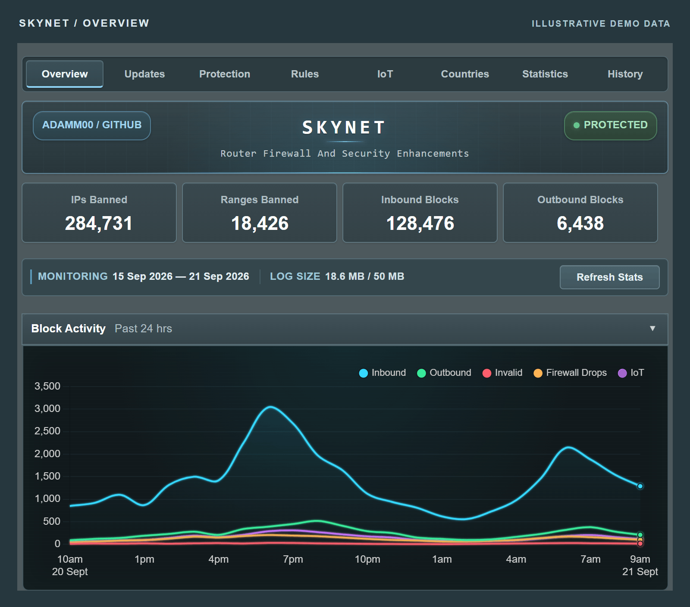

# Skynet user guide

**Set up protection. Manage your rules. Understand your traffic.**

[Project home](../README.md) · [Getting started](getting-started.md) · [WebUI guide](webui.md) · [Command reference](user-guide.md) · [Troubleshooting](troubleshooting.md)

Welcome to the Skynet v9 documentation. Use the router's **Firewall → Skynet** page for everyday management, or run `firewall` over SSH for the interactive menu. Both interfaces manage the same settings and policy.

## Start here

| Guide | What you will find |
| --- | --- |
| **[Getting started](getting-started.md)** | Requirements, installation, updating from v8 and your first visit. |
| **[Using the WebUI](webui.md)** | A tour of every tab, with practical steps for rules, feeds, history and IoT devices. |
| **[Command reference](user-guide.md)** | All CLI commands, rule behaviour, storage, retention and maintenance details. |
| **[Troubleshooting](troubleshooting.md)** | Missing charts, blocked services, source failures, clock issues and useful diagnostics. |

## Find a task

| I want to… | Go to |
| --- | --- |
| Install Skynet or update an existing installation | [Installation and upgrades](getting-started.md#install-or-update) |
| Ban an address or allow a trusted service | [Rules](webui.md#rules) |
| Choose threat feeds and set their schedule | [Updates](webui.md#updates) |
| Restrict a device's internet access | [IoT](webui.md#iot) |
| Block traffic associated with selected countries | [Countries](webui.md#countries) |
| Investigate a blocked connection | [History](webui.md#history) |
| Create or restore a backup | [Backups](webui.md#backups) |
| Understand why counters and charts differ | [Understanding the numbers](webui.md#understanding-the-numbers) |
| Resolve a problem or report a bug | [Troubleshooting](troubleshooting.md) |

## See it in action

*Illustrative demo data. Explore the [full screenshot gallery](../README.md#explore-the-interface) for rules, feeds, country bans, history, IoT and the SSH menu.*

## Keep these behaviours in mind

- Skynet's blocklists filter **IPv4**. Domain rules operate on resolved addresses, so services sharing an address can also be affected.
- **Whitelists apply to all clients** and take precedence over bans. They are not exceptions for a single device.
- **Logging is optional.** Protection and management remain available when logging is disabled.
- **IoT controls restrict WAN access.** Merlin's bridge and guest-network settings govern local isolation.

## Help and contributions

Ask questions in the [SNBForums support thread](https://www.snbforums.com/threads/skynet-v8-router-firewall-security-enhancements.96167/), or [report a bug](https://github.com/Adamm00/IPSet_ASUS/issues/new?template=01-bug-report.yml). The [troubleshooting guide](troubleshooting.md#reporting-a-problem) explains what to include.

Documentation lives alongside the code so it can be reviewed and updated with each change. Corrections and clearer examples are welcome; see [contributing to Skynet](../.github/CONTRIBUTING.md) for a quick guide.
